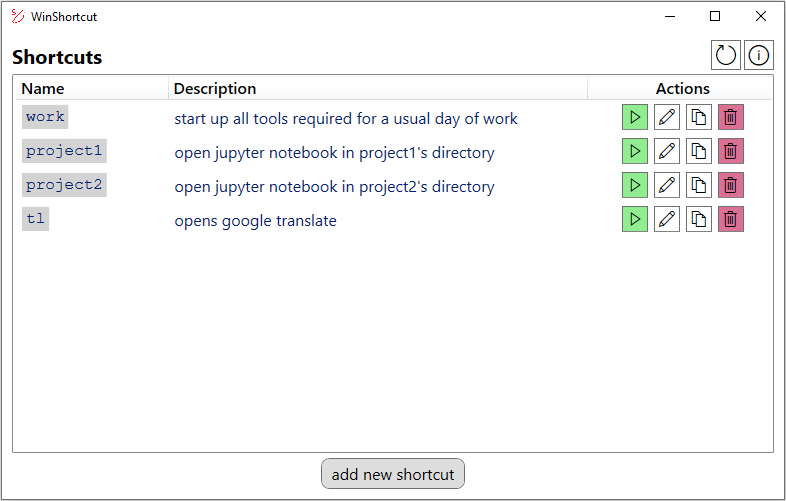
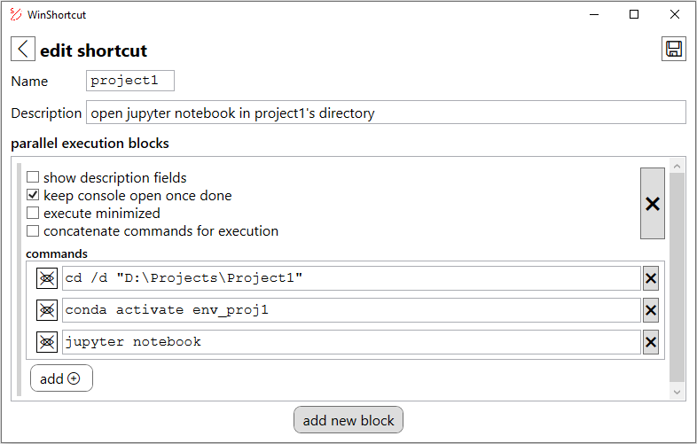
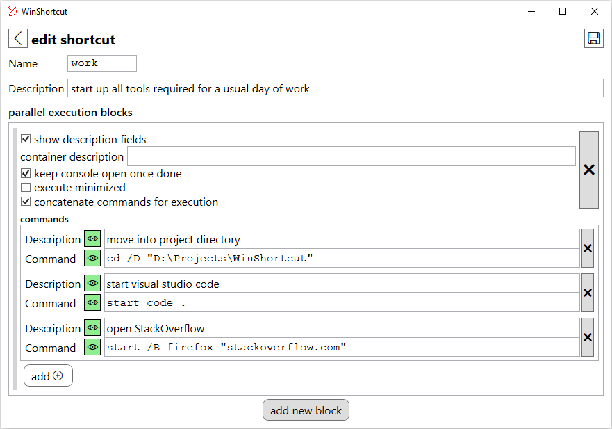

# WinShortcut - your shortcut tool

Application to define command shortcuts for Windows. This allows you to avoid the hassle of executing the same set of commands every single day. Simply use `⊞ Win + R` and type in the shortcut you have defined.

---

## Installation
The installer for this app is available at https://tigxy.github.io/WinShortcut/WinShortcut.application.

**Automatic updates:** Once a new version of the app is available, you will be asked whether you would like to install it.

---

## Usage examples
### Example 1: Starting a jupyter notebook in some project's directory 
Here is an simple example on how you can avoid the hassle of starting your jupyter notebook in a specific directory.

### Example 2: Setting up your work environment
In case you use want to create a shortcut for a more involved sequence of commands, providing descriptions for the different commands might be useful.

With the buttons (`👁`) next to the descriptions and commands you can select whether you would like to show them in the command prompt during command execution.

---

## License
MIT License - see the [LICENSE](LICENSE) file for more details.
